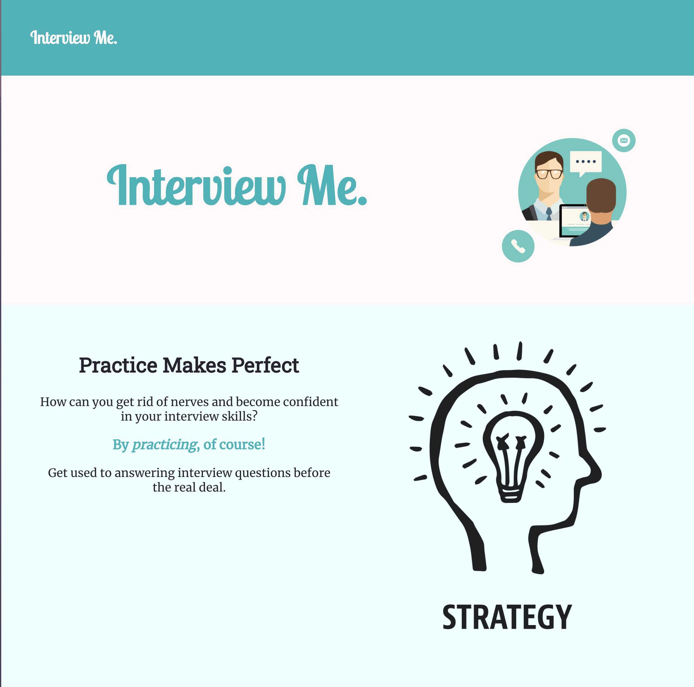
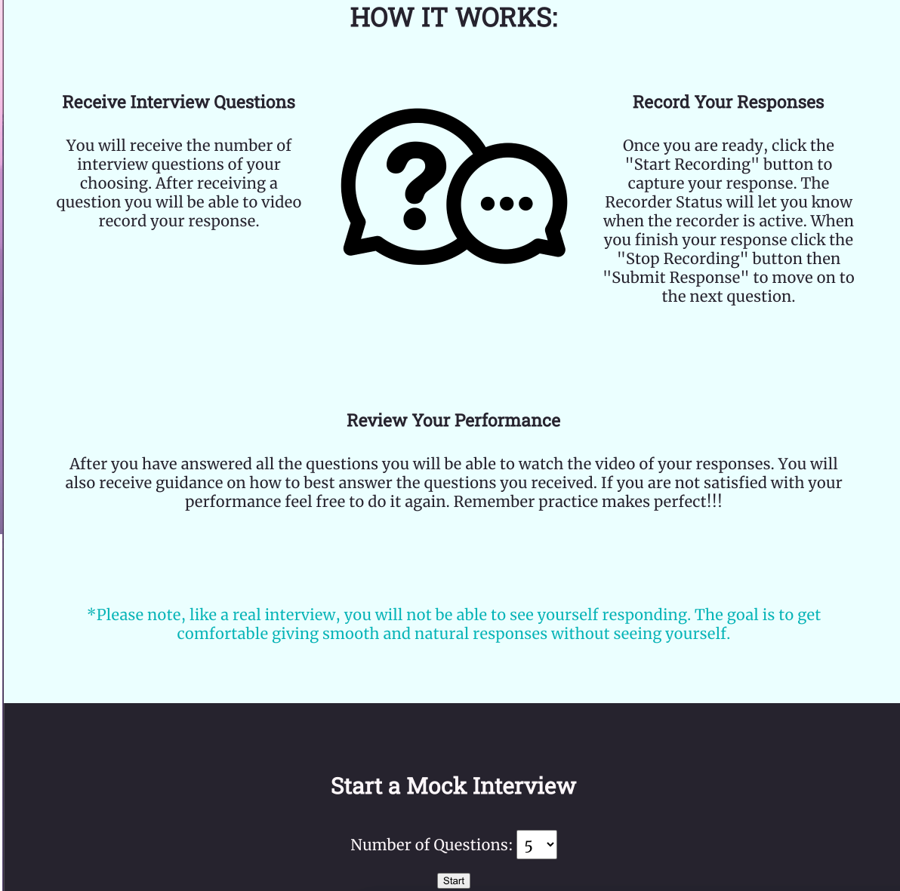
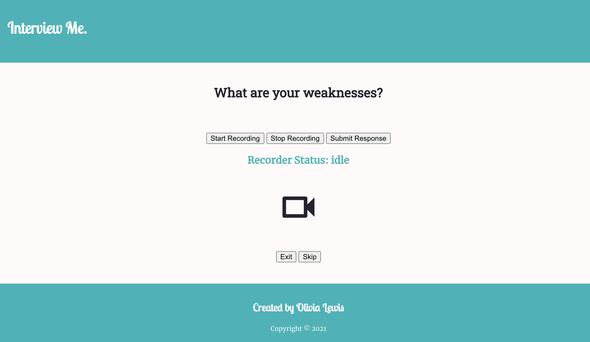
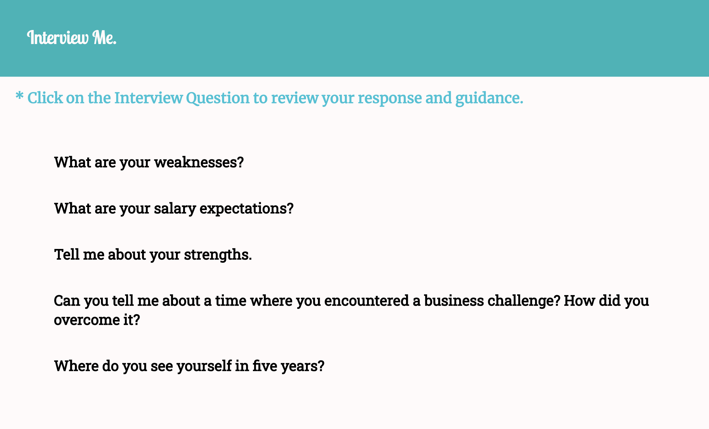
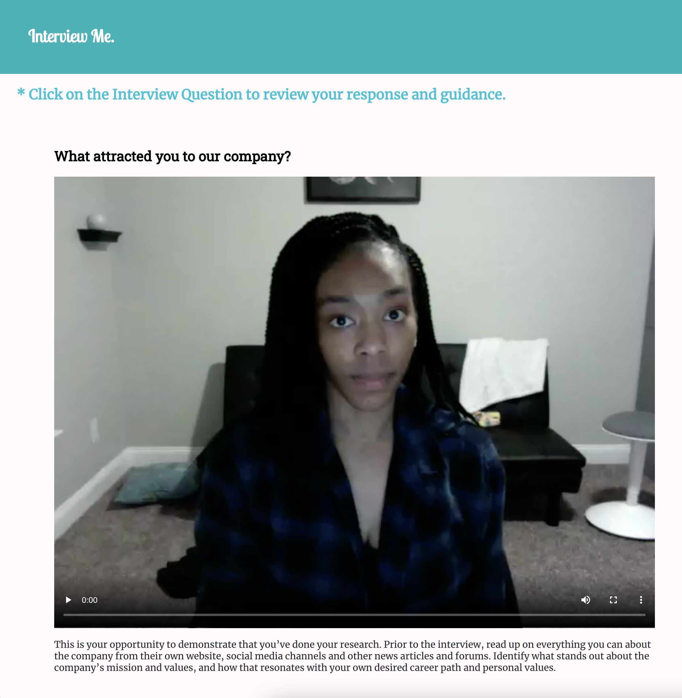

# Interview Me API

This App helps to prepare Job Seekers(Users) for interviews by prompting them with interview questions. The User will be able to video-record then review their responses.

Live App: [Interview Me](https://interview-me.vercel.app/)

Client Repo: [Interview Me Repo](https://github.com/ollythedeveloper/interview-me)

## Screenshots
Landing Page:

Interview Prompt:

Results:

Results - Selected Question/Response:

## Set up

Complete the following steps to set up locally:

1. Clone this repository to your local machine 
2. `cd` into the cloned repository and run npm install
3. Create the dev and test databases (`interview-me` and `interview-me-test`)
4. Update the `.env` with your local variables
5. Run the migrations for dev `npm run migrate`
6. Run the migrations for test `npm run migrate:test`
7. Seed the dev database `psql -U <db-user> -d interview-me -f ./seeds/seed.interview-me_questions.sql`
8. Run the test to make sure everything is working properly `npm t`
9. Start the app `npm run dev`

## Technology Used
* Node
* Express
* Postgres
